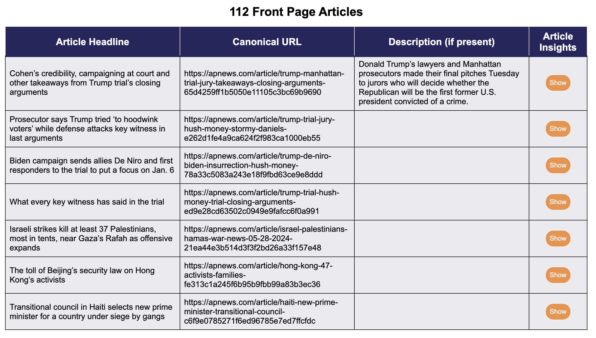
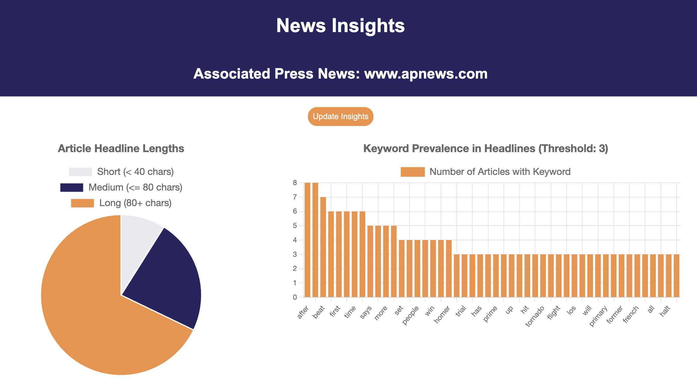
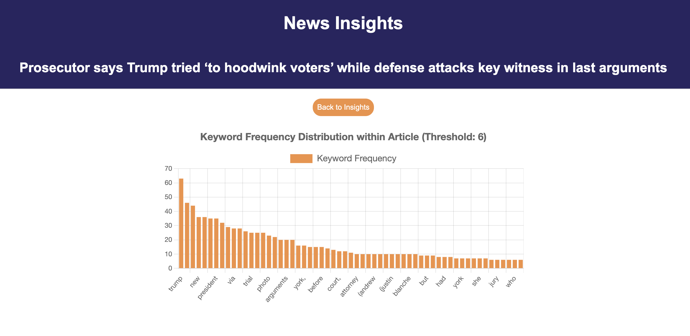

# News Scraper
Scrapes front page of Associated Press News https://www.apnews.com providing cursory headline analytics and scraped results.

---

Requirements: PHP 8.0+

---

To run: `php -S 127.0.0.1:3000 router.php`

Navigate to `localhost` in browser.

---

### Features:
* Saves local CSV containing Article Headlines, Canonical URL, Article Description, and local Reference ID.
* Quickly read article headlines and access direct link via table: 
* View headline length analysis and keyword analysis for headlines: 
* View keywords insights on a specific article: 

---

Utilizes Chart.js for chart display.